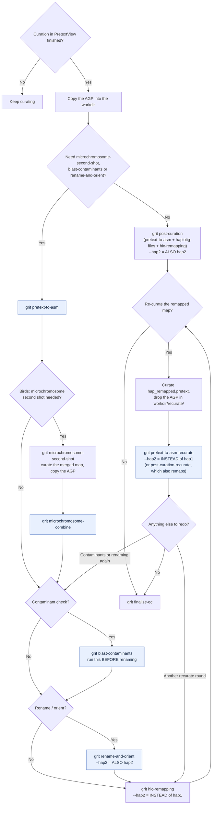

# Canonical file resolution through the curation pipeline

Which file `grit` treats as "the current assembly" for a haplotype at each point
in post-curation, and which command to run next. Read top to bottom as a
curator's decision path; the flowchart at the end is the same logic as a
diagram. For the short version, see
[`examples.md` §6](examples.md#6-which-file-is-canonical).

Everything here is **per haplotype**. hap1 and hap2 (or primary/alternate) each
have their own canonical files and their own answers to every question below;
recurating hap1 has no effect on hap2.

## The model: one flat pool, freshest wins

There are no tiers and no step that outranks another. `grit` looks at a pool of
steps, keeps the ones that still have an output on disk for this haplotype, and
returns the one with the **newest file mtime**. A tie goes to whichever step is
listed first — that is a tie-break, not a priority.

The pool differs per file type, because not every step produces every file:

| File | Steps in the pool |
|---|---|
| assembly FASTA | `pretext_to_asm`, `microchromosome_combine`, `blast_contaminants`, `rename_and_orient`, `rename_and_orient_hap2`, `pretext_to_asm_recurate[_hap2]` |
| chromosome list | the same, minus `blast_contaminants` |
| haplotigs | `pretext_to_asm`, `pretext_to_asm_recurate[_hap2]` |

`blast_contaminants` is absent from the chromosome-list pool because contaminant
filtering was assumed not to touch the chromosome list, and the rename/contam
steps are absent from the haplotigs pool because they do not produce haplotigs.

The practical consequence: **whichever pool step you ran most recently for a
haplotype owns that file.** There is no special case for recurate — running
`blast-contaminants` or `rename-and-orient` again after a recurate round makes
*that* rerun canonical. This is what lets a curator chain steps forward after
recurating without running `grit untrack` first.

Because the pools differ, one round can legitimately own the haplotigs while a
later round owns the FASTA. That is not a conflict, and `grit status` shows it
as such.

If nothing in a pool has a live tracked output — a fresh clone, a workdir
populated outside `grit` — resolution falls back to globbing the workdir:
`rename_and_orient*` run dirs first, then the `pretext_to_asm` output.

### `--hap2` does not mean the same thing everywhere

Worth knowing before running anything below, because it decides whether you get
one haplotype or two:

| Command | `--hap2` means |
|---|---|
| `post-curation` | **also** remap hap2 (hap1 still runs) |
| `rename-and-orient` | **also** do hap2, using hap1's mapping table |
| `hic-remapping` | hap2 **instead of** hap1 |
| `pretext-to-asm-recurate` | hap2 **instead of** hap1 |
| `post-curation-recurate` | hap2 **instead of** hap1 |

## User path

1. **Is curation in PretextView finished?**
   - No → keep curating. *(end)*
   - Yes → copy the AGP to the farm (`{workdir}/{tol_id}*.agp*`) → step 2.

2. **Do you need microchromosome-second-shot, blast-contaminants, or
   rename-and-orient?** These replace the default canonical FASTA (the plain
   `pretext-to-asm` output) with their own.
   - No → skip straight to step 7.
   - Yes → continue through steps 3-6, then step 7.

3. **Get a curated FASTA:** `grit pretext-to-asm -t {ticket}`.
   Canonical FASTA is now its output (`{tol_id}.{hap}.*.curated.fa`), which the
   steps below take as their input → step 4.

4. **Birds / microchromosomes: is second-shot needed?** It reads the
   `pretext-to-asm` output from step 3.
   - No → canonical unchanged → step 5.
   - Yes:
     1. `grit microchromosome-second-shot -t {ticket}`
     2. Curate the merged microchromosome map in PretextView → new AGP.
     3. Copy that AGP into the workdir.
     4. `grit microchromosome-combine -t {ticket}` — its output is now the
        freshest pool member, like any other step here.
     → step 5.

5. **Does it need a contaminant check?**
   - Yes → `grit blast-contaminants -t {ticket}`. Reads the current canonical
     FASTA; its decontaminated output becomes canonical → step 6.
   - No → canonical unchanged → step 6.

   > **Order matters here.** `blast-contaminants` finds scaffolds by matching
   > `SCAFFOLD_N`-style headers. If the current canonical FASTA came from
   > `rename-and-orient`, those headers have already been renamed, so nothing
   > matches. The step does not fail — it warns and produces a copy with
   > nothing removed. Run contaminant checking *before* renaming.

6. **Does it need renaming/orienting?**
   - Yes → `grit rename-and-orient -t {ticket} [--hap2]`. Reads the current
     canonical FASTA; its output becomes canonical → step 7.
   - No → canonical unchanged → step 7.

7. **Remap the Hi-C reads.**
   - If step 2 was "No" → `grit post-curation -t {ticket} [--hap2]`, which
     chains `pretext-to-asm`, `haplotig-files` and `hic-remapping`.
   - If step 2 was "Yes" → `grit hic-remapping -t {ticket} [--hap2]`, since
     `pretext-to-asm` already ran in step 3.
   - Either way the map is built from whichever pool member is currently
     freshest → step 8.

8. **Does the remapped map need re-curating?**
   - No → canonical is final for this round → step 9.
   - Yes:
     1. Curate `{hap}_remapped.pretext` (the `hic-remapping` output) in
        PretextView → new AGP.
     2. Drop it at `{workdir}/recurate/{tol_id}.{hap}.recurate.agp`.
     3. `grit pretext-to-asm-recurate -t {ticket} [--hap2]`, or
        `grit post-curation-recurate -t {ticket} [--hap2]` to chain
        `hic-remapping` straight after it.
     4. The step resolves the current canonical FASTA itself as its input, and
        its output becomes canonical — again with no special protection: a
        later `blast-contaminants`/`rename-and-orient`/`microchromosome-combine`
        rerun takes over.
     5. Back to `hic-remapping`, and repeat this step for another round.

   > If you want a *different* pool member to be canonical instead of whatever
   > is currently freshest, demote the freshest one with
   > `grit untrack -t {ticket} --step <step_name>` — any pool step name works.
   > `grit retrack -t {ticket} --step <step_name>` puts it back, and
   > `--untracked` on the original run keeps it out of the pool from the start.
   > See [`examples.md` §7](examples.md#7-undoing-a-step-with-untrack-and-retrack).

9. `grit finalize-qc -t {ticket}`.

## Seeing what is canonical right now

`grit status -t {ticket}` answers this in two places:

- the **Canonical files** table — the resolved path per haplotype for assembly
  FASTA, haplotigs and chromosome list, with a found/not-found marker;
- the **Canonical** column of the step-history table — which of that step's
  outputs are currently canonical: `fa`, `hap` (haplotigs), `chr` (chromosome
  list), suffixed with a 1-based haplotype index when the ticket has more than
  one haplotype.

So `pretext_to_asm_recurate` reading `hap(1),chr(1)` while `rename_and_orient`
reads `fa(1)` means a rename-and-orient run owns the FASTA and an even newer
recurate round owns the other two — each canonical for different files. Both
tables come from the same resolution call, so they cannot disagree.

## Details that matter when changing this

For anyone editing `find_canonical_fa` / `find_canonical_chr_list` /
`find_canonical_haplotigs` in `grit/utils/helpers.py`:

- A step's candidate is normally its recorded output path. When the step's
  latest successful run recorded no such output key, its run dir is re-globbed
  with that step's own `_OUTPUT_SPECS` rather than dropping the step from the
  comparison — otherwise a run with incompletely recorded outputs hands
  canonical back to an older step, moving it *backwards* in time with nothing
  in `grit status` to show for it.
- Haplotype prefixes are matched on dot-delimited tokens, so `primary` as a
  prefix does not collide with the `.primary.curated.fa` suffix that every
  curated FASTA carries.
- `pretext_to_asm_recurate` and `pretext_to_asm_recurate_hap2` are separate
  step names, as are `rename_and_orient` and `rename_and_orient_hap2`.

## Flowchart

The same decision path as a diagram. Note the loop back from step 8: after a
recurate round you can run the contaminant or renaming steps again, and *they*
become canonical — recurate holds no special position.

Highlighted nodes are the steps that produce a new canonical candidate; every
other node reads the canonical files without replacing them. Whichever
highlighted step ran most recently for a haplotype owns that haplotype's files.
