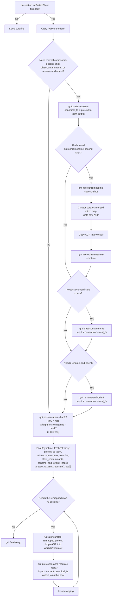

# Canonical FASTA priority through the curation pipeline

This describes, per haplotype, which file `grit` treats as "the canonical
assembly" (`find_canonical_fa` in `grit/utils/helpers.py`) at each point in
the post-curation pipeline, and which command to run next. Read top to
bottom as a curator's decision path; the flowchart below is the same logic
as a diagram.

Everything here is **per haplotype** — hap1 and hap2 (or primary/alternate)
each have their own canonical FASTA and their own answers to every question
below. Recurating hap1 has no effect on hap2's canonical FASTA, and vice
versa.

## The model: one flat pool, freshest wins

`find_canonical_fa(ctx, hap_prefix)` does not use tiers or an "unconditional
top" step. It looks at a single ordered pool of tracker step names —

```
pretext_to_asm, microchromosome_combine, blast_contaminants,
rename_and_orient, rename_and_orient_hap2, pretext_to_asm_recurate[_hap2]
```

— and, among the steps in that pool that actually have a tracked, still-on-disk
output for this haplotype, returns the one with the **newest file mtime**. A
tie (including "only one candidate exists") goes to whichever step is listed
first above — this only matters as a tie-break, not as a priority order.

If nothing in the pool has a live tracked output, `find_canonical_fa` falls
back to a filesystem glob in `{workdir}/rename_and_orient/`, and finally to
the plain `pretext_to_asm` curated FASTA (via `find_curated_fa`).

`find_canonical_chr_list` uses the same shape, with `blast_contaminants`
dropped from the pool (contaminant filtering doesn't touch the chromosome
list) and its own filesystem fallback chain (`rename_and_orient` dir glob →
`pretext_to_asm` dir glob). `find_canonical_haplotigs` has the smallest pool
— just `pretext_to_asm` and this haplotype's `pretext_to_asm_recurate[_hap2]`
— since contamination/rename steps don't touch haplotigs, falling back to a
glob in the latest `pretext_to_asm` run dir.

The practical consequence: **whichever of these steps you ran most recently
for a haplotype is canonical for it**, full stop. There is no special case
for recurate — running `blast-contaminants` or `rename-and-orient` again
after a `pretext-to-asm-recurate` round makes *that* rerun canonical, the
same as it always would. This is what unblocks the "chain forward from
recurate" workflow: a curator can run `blast-contaminants` /
`rename-and-orient` again after recurating without first running `grit
untrack` — the freshest output simply takes over.

## User path

1. **Is curation in PretextView finished?**
   - No → keep curating. *(end)*
   - Yes → copy the AGP to the farm (`{workdir}/{tol_id}*.agp*`) → step 2.

2. **Need microchromosome-second-shot, blast-contaminants, or
   rename-and-orient?** These steps replace the default canonical_fa
   (the plain `pretext-to-asm` output) with their own output.
   - No → skip straight to step 7.
   - Yes → continue to steps 3-6, then step 7.

3. **Get a curated FASTA:** run `grit pretext-to-asm -t {ticket}`.
   **canonical_fa = pretext-to-asm output** (`{tol_id}.{hap}.*.curated.fa`)
   — used as input by the following steps → step 4.

4. **Birds / microchromosome-second-shot: is that workflow needed?** It
   depends on the `pretext-to-asm` output from step 3 (`find_canonical_fa`
   looks it up as input).
   - No → canonical_fa is unchanged (still the pretext-to-asm output) →
     step 5.
   - Yes → run the full second-shot sequence:
     1. `grit microchromosome-second-shot -t {ticket}`
     2. Curator curates the merged micro-chromosome map in PretextView →
        gets a new AGP.
     3. Copy that AGP into the workdir.
     4. `grit microchromosome-combine -t {ticket}`.
        **canonical_fa = microchromosome-combine output** — it's just the
        freshest pool member now, same as any other step here.
     → step 5.

5. **Does it need a contaminant check?**
   - Yes → run `grit blast-contaminants -t {ticket}`. The step reads the
     current canonical_fa as input via `find_canonical_fa`.
     **canonical_fa = the decontaminated FASTA** (its output) → step 6.
   - No → canonical_fa is unchanged → step 6.

   > **Known limitation:** `blast-contaminants` extracts scaffold IDs by
   > matching `SCAFFOLD_N`-style headers in the input FASTA. If the current
   > canonical_fa is a `rename-and-orient` output, its headers have already
   > been renamed away from that pattern, so no scaffold IDs are found. The
   > step does not fail — it warns and continues, producing a FASTA copy
   > with nothing removed. This is an accepted limitation of running
   > `blast-contaminants` after `rename-and-orient` on the same haplotype,
   > not a bug to file: run contaminant checking before renaming/orienting
   > if you need it to actually filter anything.

6. **Does it need renaming/orienting?**
   - Yes → run `grit rename-and-orient -t {ticket}`. Reads the current
     canonical_fa (whatever `find_canonical_fa` currently resolves to) as
     input. **canonical_fa = its output** → step 7.
   - No → canonical_fa is unchanged → step 7.

7. **Remap the Hi-C reads.**
   - If step 2 was "No" (no canonical_fa exists yet) → run
     `grit post-curation -t {ticket} [--hap2]`. This chains
     `pretext-to-asm` + `hic-remapping` in one go; `--hap2` runs both
     haplotypes at once.
   - If step 2 was "Yes" (canonical_fa already set by one of steps 3-6) →
     run `grit hic-remapping -t {ticket} [--hap2]`.
   - Output: the curated Hi-C map, built from whichever pool member is
     currently freshest (depends on which of steps 3-6 actually ran) →
     step 8.

8. **Does the remapped (already-curated) Hi-C map need re-curating?**
   - No → canonical_fa is final for this round → step 9.
   - Yes →
     1. The curator curates `{hap}_remapped.pretext` (the `hic-remapping`
        output) in PretextView and gets a new AGP.
     2. Drop the AGP into `{workdir}/recurate/{tol_id}.{hap}.recurate.agp`.
     3. Run `grit pretext-to-asm-recurate [--hap2] -t {ticket}`
        (or `grit post-curation-recurate [--hap2]` to chain
        `hic-remapping` right after it).
     4. The command resolves the **current** canonical_fa itself (via
        `find_canonical_fa`, whatever it currently is) as its input.
     5. **canonical_fa = the recurate output** — it is now the freshest
        pool member, exactly like any other step's output would be. If you
        later re-run `blast-contaminants`/`rename-and-orient`/
        `microchromosome-combine`, *that* rerun becomes canonical instead —
        there's no special protection keeping the recurate output on top.
     6. Go back to `hic-remapping` with the new canonical_fa (repeat step 8
        for another round if needed).

   > If, after recuration, the curator wants to run
   > blast-contaminants/rename-and-orient again but a *different* step's
   > output should be canonical instead of whatever is currently freshest —
   > use `grit untrack --step <step_name> -t {ticket}` (any step name in
   > the pool: `pretext_to_asm_recurate[_hap2]`, `rename_and_orient[_hap2]`,
   > `blast_contaminants`, `microchromosome_combine`, ...) to mark that
   > step's latest run as non-canonical, which lets the next-freshest pool
   > member take over. `grit untrack --step <step> --undo` reverses it.
   > This is the uniform escape hatch for the whole pool — it replaces the
   > old recurate-only workaround.

9. Run `grit finalize-qc -t {ticket}`.

## Seeing what's canonical right now

`grit status -t {ticket}` prints a step-history table with a `Canonical`
column. For each step, the column lists which specific output type(s) —
`fa` (assembly FASTA), `hap` (haplotigs), `chr` (chromosome list) — of that
step's recorded outputs currently match what `find_canonical_fa` /
`find_canonical_chr_list` / `find_canonical_haplotigs` resolve to, e.g.
`fa(1)` or `hap(1),chr(1)`. The `(N)` suffix is a 1-based haplotype index
(only shown when the ticket has more than one haplotype) — it's a direct
readout of the pool logic above per haplotype, not a separate heuristic.

This replaces an earlier, ambiguous design where the column showed a bare
`★` whenever *any* recorded output matched *any* canonical path for *any*
haplotype and type. That collapsed genuinely distinct facts into one
symbol: because `find_canonical_haplotigs`'s pool is smaller than
`find_canonical_fa`'s/`find_canonical_chr_list`'s (`rename_and_orient` never
produces a haplotigs output, so it isn't a candidate there — it does
produce both a renamed FASTA and a chromosome-list CSV, and genuinely
competes by mtime in both of those pools), a recurate round and a later
rename-and-orient round can *both* be legitimately canonical at once —
recurate for haplotigs (always, since rename_and_orient can't win that
pool), rename-and-orient for the FASTA and/or chromosome list if its run is
the freshest tracked output. The old marker starred all four rows
(`pretext_to_asm_recurate[_hap2]` and `rename_and_orient[_hap2]`)
identically, with no way to tell that they were canonical for different
things rather than actually conflicting. The per-type marker makes that
explicit: e.g. `pretext_to_asm_recurate` reading `hap(1),chr(1)` and
`rename_and_orient` reading `fa(1)` (rename-and-orient ran, but an even
newer recurate round still owns the chromosome list) — or
`rename_and_orient` reading `fa(1),chr(1)` when its run is fresher than
everything else in both pools — both correct, both visibly different.

The same view also prints a dedicated "Canonical files" table (fa /
haplotigs / chr list per haplotype, with a found/not-found marker) above the
step history — it was never ambiguous in this way, since it already lists
hap/type/file as separate columns; both tables are computed from the same
`_resolve_canonical_files` call, so they can't disagree.

## Flowchart


