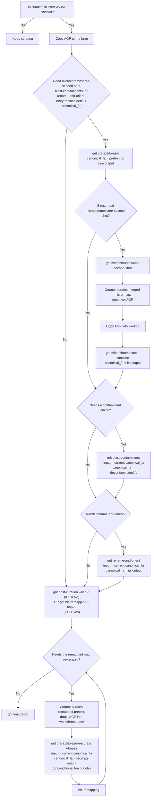

# Canonical FASTA priority through the curation pipeline

This describes, per haplotype, which file `grit` treats as "the canonical
assembly" (`find_canonical_fa` in `grit/utils/helpers.py`) at each point in
the post-curation pipeline, and which command to run next. Read top to
bottom as a curator's decision path; the flowchart below is the same logic
as a diagram.

Everything here is **per haplotype** — hap1 and hap2 (or primary/alternate)
each have their own canonical FASTA and their own answers to every question
below. Recurating hap1 has no effect on hap2's canonical FASTA, and vice
versa.

## User path

1. **Is curation in PretextView finished?**
   - No → keep curating. *(end)*
   - Yes → copy the AGP to the farm (`{workdir}/{tol_id}*.agp*`) → step 2.

2. **Need microchromosome-second-shot, blast-contaminants, or
   rename-and-orient?** These steps replace the default canonical_fa
   (the plain `pretext-to-asm` output) with their own output, so they
   need to be run more deliberately/carefully.
   - No → skip straight to step 7.
   - Yes → continue to steps 3-6, then step 7.

3. **Get a curated FASTA:** run `grit pretext-to-asm -t {ticket}`.
   **canonical_fa = pretext-to-asm output** (`{tol_id}.{hap}.*.curated.fa`)
   — used as input by the following steps → step 4.

4. **Birds / microchromosome-second-shot: is that workflow needed?** It
   depends on the `pretext-to-asm` output from step 3 (`find_canonical_fa`
   looks it up as input).
   - No → canonical_fa is unchanged (still the pretext-to-asm output) →
     step 5.
   - Yes → run the full second-shot sequence:
     1. `grit microchromosome-second-shot -t {ticket}`
     2. Curator curates the merged micro-chromosome map in PretextView →
        gets a new AGP.
     3. Copy that AGP into the workdir.
     4. `grit microchromosome-combine -t {ticket}`.
        **canonical_fa = microchromosome-combine output** — a
        birds-specific replacement for the plain pretext-to-asm output, at
        the same priority level. The two are mutually exclusive
        alternatives, not sequential.
     → step 5.

5. **Does it need a contaminant check?**
   - Yes → run `grit blast-contaminants -t {ticket}`. The step reads the
     current canonical_fa as input. **canonical_fa = the decontaminated
     FASTA** (its output) → step 6.
   - No → canonical_fa is unchanged → step 6.

6. **Does it need renaming/orienting?**
   - Yes → run `grit rename-and-orient -t {ticket}`. Reads the current
     canonical_fa (the decontaminated one if step 5 ran; otherwise the
     pretext-to-asm / microchromosome-combine output) as input.
     **canonical_fa = its output** — the highest priority among the
     regular (non-recurate) steps → step 7.
   - No → canonical_fa is unchanged → step 7.

7. **Remap the Hi-C reads.**
   - If step 2 was "No" (no canonical_fa exists yet) → run
     `grit post-curation -t {ticket} [--hap2]`. This chains
     `pretext-to-asm` + `hic-remapping` in one go; `--hap2` runs both
     haplotypes at once.
   - If step 2 was "Yes" (canonical_fa already set by one of steps 3-6) →
     run `grit hic-remapping -t {ticket} [--hap2]`.
   - Output: the curated Hi-C map, with canonical_fa being whichever tier
     is highest per the priority order below (depends on which of steps
     3-6 actually ran) → step 8.

8. **Does the remapped (already-curated) Hi-C map need re-curating?**
   - No → canonical_fa is final for this round → step 9.
   - Yes →
     1. The curator curates `{hap}_remapped.pretext` (the `hic-remapping`
        output) in PretextView and gets a new AGP.
     2. Drop the AGP into `{workdir}/recurate/{tol_id}.{hap}.recurate.agp`.
     3. Run `grit pretext-to-asm-recurate [--hap2] -t {ticket}`
        (or `grit post-curation-recurate [--hap2]` to chain
        `hic-remapping` right after it).
     4. The command resolves the **current** canonical_fa itself (whatever
        it currently is — after blast-contaminants/rename-and-orient/etc.)
        as its input.
     5. **canonical_fa = the recurate output — unconditionally, regardless
        of the mtime of any other step.** This is a fixed top priority,
        above steps 3-6, even if one of them is re-run later with a newer
        mtime.
     6. Go back to `hic-remapping` with the new canonical_fa (repeat step 8
        for another round if needed).

   > If, after recuration, the curator still wants to run
   > blast-contaminants/rename-and-orient against the **original**
   > (pre-recurate) output — first run `grit untrack --step
   > pretext_to_asm_recurate[_hap2] -t {ticket}`, which rolls canonical_fa
   > back to the pre-recuration state.

9. Run `grit finalize-qc -t {ticket}`.

## Priority order (highest wins)

```
pretext_to_asm_recurate[_hap2]              ← unconditional, if it exists
        ↓ (otherwise look below, by mtime — the freshest wins)
rename_and_orient[_hap2] / blast_contaminants
        ↕ (compared by mtime; on a tie the tier above wins)
microchromosome_combine / pretext_to_asm
        ↓ (otherwise — filesystem fallback)
rename_and_orient/ dir glob → pretext_to_asm run dir glob
```

`find_canonical_chr_list` follows the same shape, minus
`blast_contaminants` (contaminant filtering doesn't touch the chromosome
list). `find_canonical_haplotigs` only has `pretext_to_asm_recurate[_hap2]`
on top and `pretext_to_asm` at the bottom, with no intermediate tiers
(contamination/rename don't touch haplotigs).

## Flowchart


